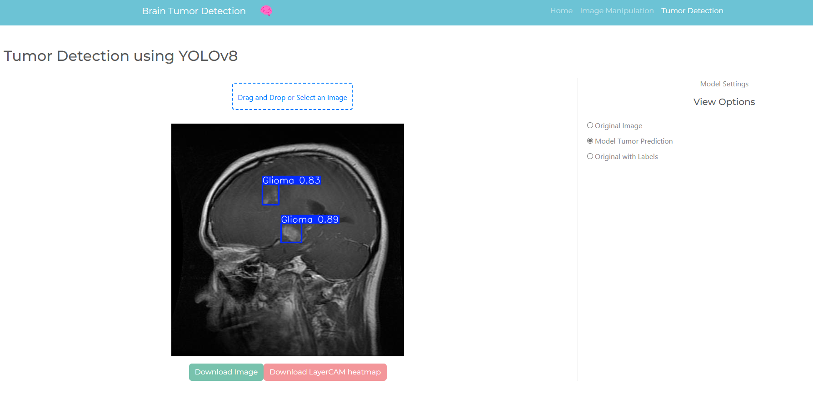
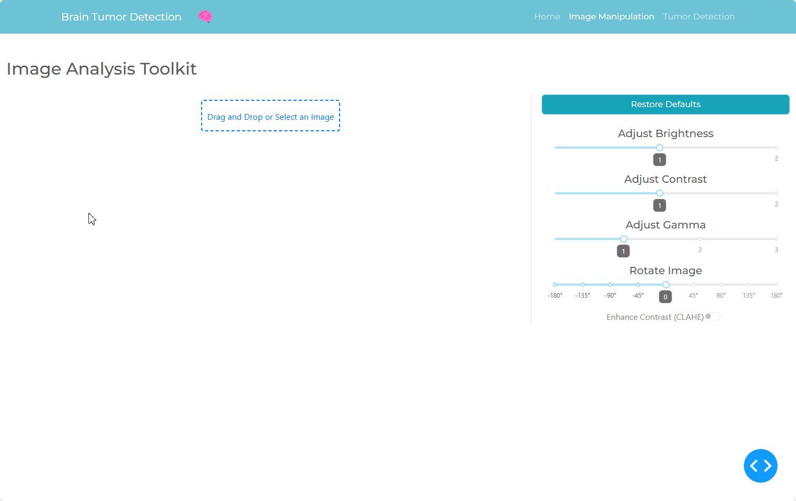
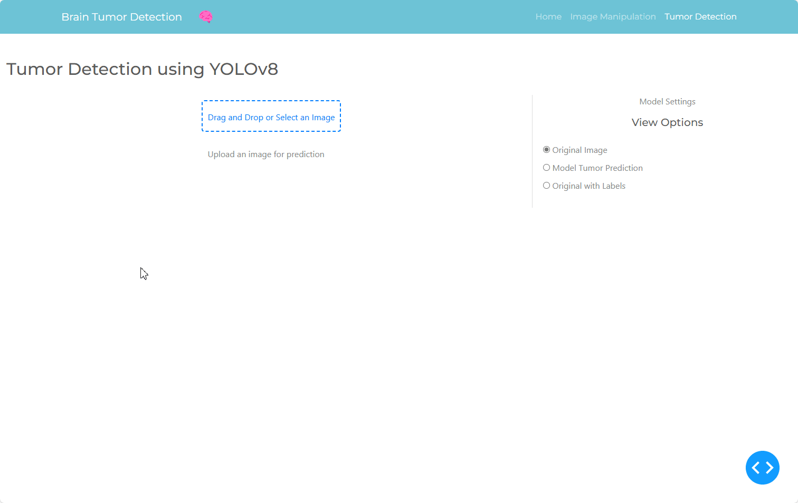

# BrainScan AI



## What is BrainScan AI?

**BrainScan AI** is a proof-of-concept web app demonstrating how artificial intelligence can assist in detecting brain tumors from MRI scans. It provides an intuitive interface for doctors and researchers to explore brain images and make predictions using AI. The app is designed to classify four types of brain tumors: **Glioma**, **Meningioma**, **No Tumor**, and **Pituitary**.

While the model delivers promising results, it does have limitations. In some instances, the model may misclassify a tumor, fail to detect a specific region, or the LayerCAM explainability feature may not highlight any relevant pixels. As a proof-of-concept app, BrainScan AI is fully functional and can already be used and tested, but it also has significant potential for further improvements in the future.


## How Does the App Work?

The app’s detailed functionality can be explored on the **Home Page**. However, here is a brief overview of its main features:

---

### Home Page

The **Home Page** provides an in-depth explanation of how the app works. Here, you can download brain MRI images, learn about the model and the dataset used for training, and find additional useful information about the app’s functionality. You'll also find explanations of the roles and contributions of the development team.

---

### Image Manipulation Page

On the **Image Manipulation Page**, you can upload any image and easily apply adjustments such as brightness and contrast control, zoom, and more.



---

### Tumor Detection Page

On the **Tumor Detection Page**, you can upload an image to see if the model accurately predicts the tumor’s class and location, along with the confidence level of its prediction. You can also download a heatmap that highlights which pixels were most important in the model's decision-making process. Explainability and transparency are very important to us.



---

## Installation Guide

### Step 1: Clone the Repository

Clone this repository to your local machine using the following command:

```bash
git clone https://github.com/FranciscoRMansilha/BrainScan-AI
```

### Step 2: Navigate to the Project Directory

Change into the cloned repository's directory:

```bash
cd BrainScan-AI
```

### Step 3: Create and Activate a Conda Environment

Create a new Conda environment with Python 3.10.14:

```bash
conda create --name myenv python=3.10.14
```

Activate the Conda environment:

```bash
conda activate myenv
```

### Step 4: Install Dependencies

Install the required dependencies from the `requirements.txt` file:

```bash
pip install -r requirements.txt
```

### Step 5: Run the Application

Run the application using the following command:

```bash
python main.py
```

The app should now be running on your local machine. The terminal will display the URL where you can access it. Please note that it may take a minute to download the model, but if you run into problems you can download the model from this [link](https://drive.google.com/file/d/1buPbVkrHP6PbCyi6z5HBRZjWx7LIa7xx/view?usp=sharing) and place it on the `pages` directory 🙂

## Authors and Acknowledgments

**BrainScan AI** was developed by two Data Science and AI students:

- **[Francisco Mansilha](https://www.linkedin.com/in/francisco-mansilha/)** – Concept, dataset preparation, model training, and app creation
- **[Lea Banovac](https://www.linkedin.com/in/lea-banovac-29191a24b/)** – Explainable AI feature development using LayerCAM

Feel free to contact us through our Linkedin if you would like to ask any question or bring any problem to our attention!

---
